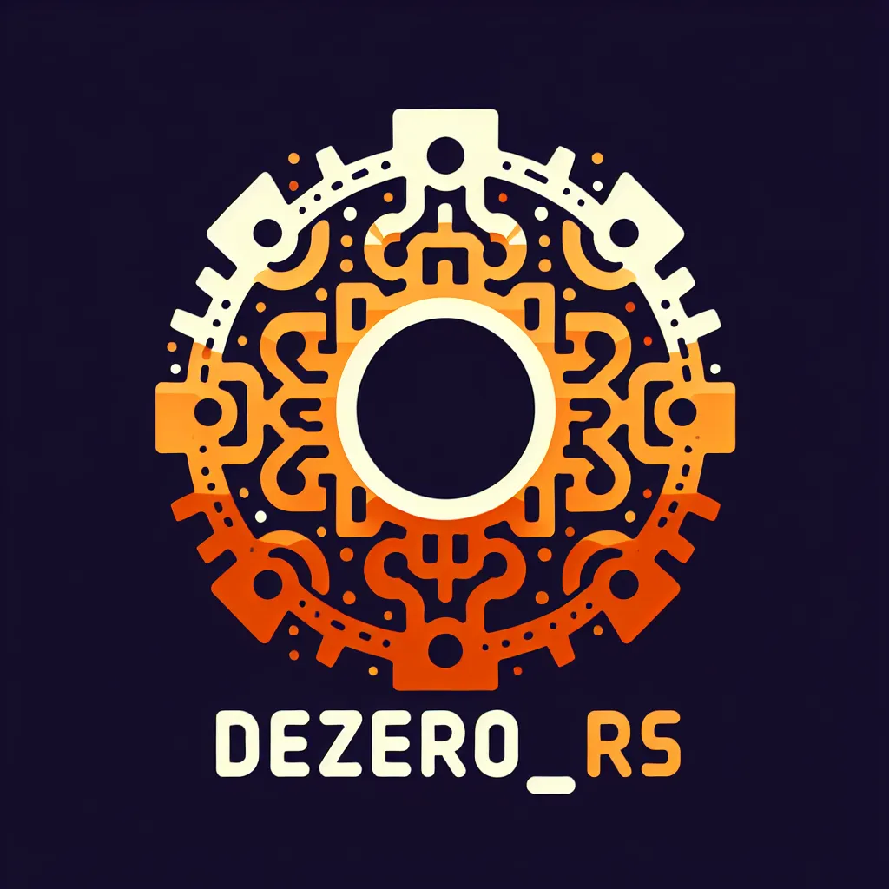

# dezero_rs

`dezero_rs` is a Rust-based clone of the `dezero` framework, originally designed for deep learning experiments. This project is primarily an educational endeavor aimed at understanding and implementing deep learning frameworks in Rust. It serves as an experimental platform for my personal learning and exploration of both Rust programming and deep learning concepts.

## Purpose

- **Educational:** The primary goal of `dezero_rs` is educational. It is a means for me to dive deep into the intricacies of deep learning frameworks and how they can be implemented in a systems programming language like Rust.
- **Experimental:** This project is experimental in nature. It allows for exploration of new ideas and techniques in the context of deep learning and Rust programming.

## Features

- **Pure Rust Implementation:** `dezero_rs` is built entirely in Rust, aiming to leverage the language's safety and performance characteristics for educational purposes.
- **Manual Linear Algebra:** Linear algebra operations are implemented manually using vectors. This manual approach provides a deeper understanding of the underlying mathematics, albeit at the cost of slower computation speeds.

## Current Limitations

- **Performance:** The manual implementation of linear algebra components results in performance issues, particularly in computation-intensive tasks. This limitation is acknowledged and accepted in the context of the project's educational objectives.
- **Learning Capability:** Currently, `dezero_rs` struggles to successfully learn from the MNIST dataset, a fundamental benchmark in machine learning for handwritten digit classification. This challenge presents a valuable learning opportunity in debugging and improving machine learning algorithms.

## Contributions

While `dezero_rs` is primarily for my personal educational purposes, contributions are welcome, especially from those interested in learning alongside me or offering insights that could enhance the project's educational value:

- **Educational Enhancements:** Suggestions that improve the understanding of deep learning or Rust programming.
- **Performance Optimization:** Contributions that address performance bottlenecks without compromising the project's educational goals.
- **Feature Expansion:** Adding features to more closely align with the original `dezero` framework's capabilities, enriching the learning experience.

## License

`dezero_rs` is released under the MIT License. See the [LICENSE](LICENSE) file for more details.
